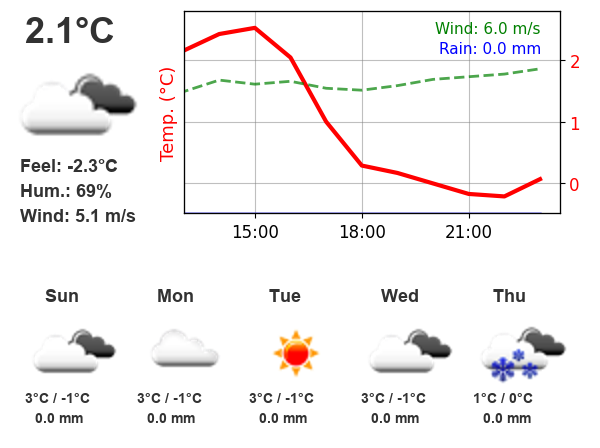
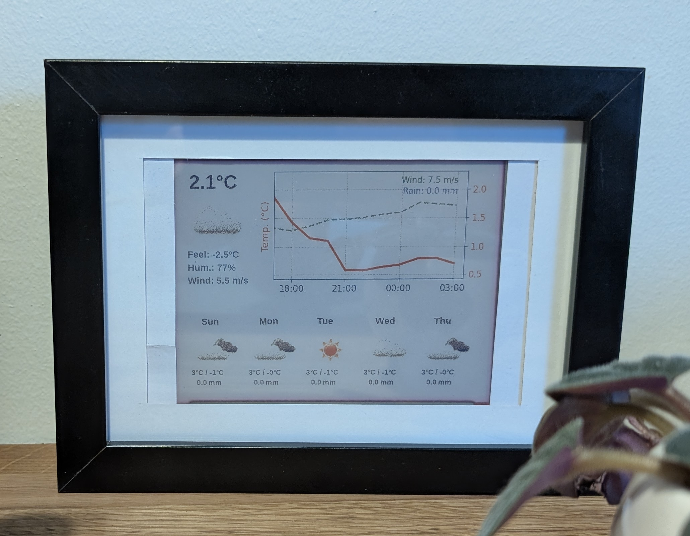

# ESP32 Weather Display with Waveshare 5.65-inch e-Paper

This project displays weather information on a Waveshare 5.65-inch e-Paper display connected to an ESP32. It fetches weather data from various providers (OpenWeatherMap, Open-Meteo, Meteomatics, Google Weather), generates an image with the forecast, and uploads it to the ESP32 for display.

## Features

* Displays current weather conditions (temperature, icon, description).
* Shows a detailed hourly forecast graph (temperature, wind, rain).
* Provides a multi-day forecast summary (icons, high/low temperatures, rain, wind, UV).
* Supports multiple weather data providers (OpenWeatherMap, Open-Meteo, Meteomatics, Google Weather, SMHI) via configuration.
* **Mix and Match Data:** Optionally supplement data from the primary provider with specific parameters (like UV index) from other configured providers.
* Selectable icon source (OWM or Google) independent of the data provider.
* Caches weather data to reduce API calls.
* Provider-specific caching: Cache is invalidated if the weather provider is changed.
* Configurable cache lifetime.
* Asynchronous data fetching for improved performance.
* Optimized for 7-color e-Paper displays.





## Hardware Requirements

* ESP32 development board
* Waveshare 5.65-inch e-Paper (F) display
* Jumper wires

## Software Requirements

* Python 3.7 or higher (due to newer library features like `datetime.fromisoformat`)
* Required Python packages (install with `pip install -r requirements.txt`):
    * requests
    * Pillow (PIL)
    * matplotlib
    * pysmhi
    * IPy
    * aiohttp

## Resources

* [Waveshare E-Ink display](https://www.waveshare.com/wiki/E-Paper_ESP32_Driver_Board)
* [Waveshare FW for ESP32](https://files.waveshare.com/upload/5/50/E-Paper_ESP32_Driver_Board_Code.7z)

## Setup

1.  **Configure ESP32:**
    *   Follow the instructions in the Waveshare e-Paper Wiki to set up the display with your ESP32. You'll need to install the ESP32 Arduino core and the e-Paper driver library.
    *   Flash the `.ino` file found in the `Loader_esp32wf` directory of the linked Waveshare firmware above. **Important:** Update your WiFi details in the `srvr.h` file before flashing. This creates a web interface on the ESP32 that allows uploading images. Note the IP address assigned to your ESP32.
2.  **Configure Python Script:**
    *   **Obtain Credentials:** Get the necessary API keys or credentials for the weather data provider(s) you intend to use:
        *   **OpenWeatherMap:** API Key for One Call API 3.0.
        *   **Open-Meteo:** No key required.
        *   **Meteomatics:** Username and Password.
        *   **SMHI:** No key required (uses `pysmhi` library).
        *   **Google Weather:** Google Cloud Platform API Key with Weather API enabled (Note: This is a paid service).
    *   **Create `config.json`:** Create a file named `config.json` in the same directory as the Python scripts. Use the example below and fill in your details:

        ```json
        {
           "latitude": YOUR_LATITUDE,
           "longitude": YOUR_LONGITUDE,
           "server_ip": "YOUR_ESP32_IP_ADDRESS",
           "weather_provider": "smhi",
           "icon_provider": "openweathermap",
           "provider_list" : ["open-meteo", "openweathermap", "meteomatics", "google", "smhi"],
           "cache_duration_minutes": 10,
           "google_api_key": "YOUR_GOOGLE_MAPS_API_KEY",
           "openweathermap_api_key": "YOUR_OPENWEATHERMAP_API_KEY",
           "meteomatics_username": "YOUR_METEOMATICS_USERNAME",
           "meteomatics_password": "YOUR_METEOMATICS_PASSWORD",
        }
        ```
    *   **Configuration Details:**
        *   `latitude`, `longitude`: Your location.
        *   `server_ip`: The IP address of your ESP32 running the web server firmware. Leave empty (`""`) if not uploading.
        *   `weather_provider`: Choose the source for weather data: `"openweathermap"`, `"open-meteo"`, `"meteomatics"`, or `"google"`.
        *   `icon_provider`: Choose the source for icons: `"openweathermap"` (uses OWM-style icons, recommended for e-ink contrast) or `"google"` (uses Google icons if available in the data).
        *   Fill in the corresponding API key/credentials for your chosen `weather_provider`. Keys for unused providers can be left blank or as placeholders.
                *   `cache_duration_minutes`: (Integer, optional) How long the weather data cache is considered fresh, in minutes. Defaults to `60` if not specified.

    *   **Supplemental Providers (Optional):**
        You can configure the script to fetch specific data points from providers other than your primary `weather_provider` and merge them into the main dataset. This is useful if your primary provider lacks certain parameters (like UV index from SMHI's point forecast).

        Add a `supplemental_providers` key to your `config.json`. This should be a list of objects, each specifying a `provider_name` and a list of `parameters` to merge.

        ```json
        {
          "...": "your primary config here",
          "supplemental_providers": [
            {
              "provider_name": "open-meteo",
              "parameters": ["uvi", "rain"]
            },
            {
              "provider_name": "google",
              "parameters": ["wind_speed"]
            }
          ]
        }
        ```

        **Available Parameters for Merging:**
        Common parameters you can list in the `"parameters"` array include: `"temp"`, `"feels_like"`, `"humidity"`, `"uvi"`, `"wind_speed"`, `"wind_gust"`, `"weather"`, `"rain"`, `"snow"`, `"summary"`.
        Note that the supplemental provider must actually provide data for the parameters you list. Merging replaces the entire value for that parameter (including nested dictionaries/lists like `temp` for daily or `weather`).

3.  **Install Requirements:**
    *   Open a terminal or command prompt in the project directory.
    *   Run: `pip install -r requirements.txt`
4.  **Run the Script:**
    *   Execute `python create_weather_info.py`. This will fetch weather data (using cache if available), create the `weather_forecast_graph.png` image, and attempt to upload it to your ESP32 if `server_ip` is configured.
    *   By default, the script will look for `config.json` in the same directory as `create_weather_info.py`.
    *   You can specify a custom path to your configuration file using the `--config` argument:
        ```bash
        python c:\Toolz\weather_display\create_weather_info.py --config /path/to/your/custom_config.json
        ```


## Customization

*   **Providers:** Select your preferred `weather_provider` and `icon_provider` in `config.json`.
*   **Font:** Change the `font_path` variables in `create_weather_info.py` to use different TrueType fonts.
*   **Colors:** Modify the color value tuples (RGB) in `create_weather_info.py` to customize the display's appearance.
*   **Display:** Adjust the image processing and upload code in `upload.py` to support different e-Paper display models or upload methods.

## Troubleshooting

*   **Display Issues:** Double-check the wiring between the ESP32 and the e-Paper display. Ensure the correct Waveshare firmware is flashed and running.
*   **Network Errors:** Verify your ESP32 is connected to your WiFi network. Confirm the `server_ip` in `config.json` matches the ESP32's actual IP address. Check firewall settings if applicable.
*   **API Errors:**
    *   Verify the API key/credentials in `config.yaml` for your selected `weather_provider` are correct and active.
    *   Check the script output for specific error messages from the provider (e.g., 401 Unauthorized, 403 Forbidden, 429 Rate Limit).
    *   Consult the documentation for your chosen weather provider regarding API limits and potential costs (especially Google Weather).
    *   Check the status page of the weather provider if errors persist.
*   **Icon Issues:** Ensure the `icon_provider` setting is correct. If icons are missing, check the script output for warnings about unmapped conditions or download errors. Clear the `icon_cache` directory if you suspect corrupted icons.
*   **`AttributeError: 'FreeTypeFont' object has no attribute 'getsize'`:** You are likely using Pillow 10.0.0 or newer. Ensure `create_weather_info.py` uses `font.getlength(text)` instead of `font.getsize(text)[0]` for calculating text width.

## Contributing

Contributions are welcome! Feel free to submit pull requests for bug fixes, new features, or improvements.

## License

This project is licensed under the MIT License - see the LICENSE file for details.
