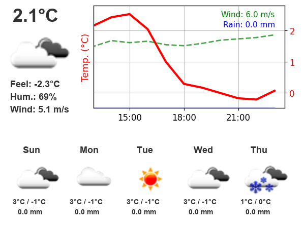
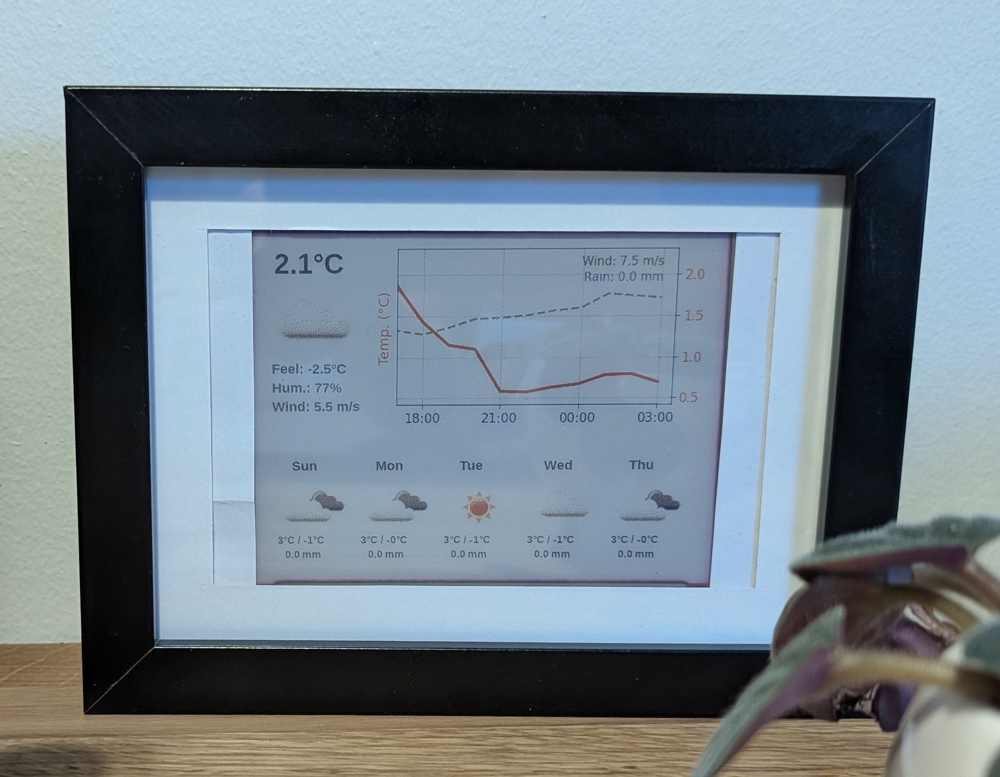
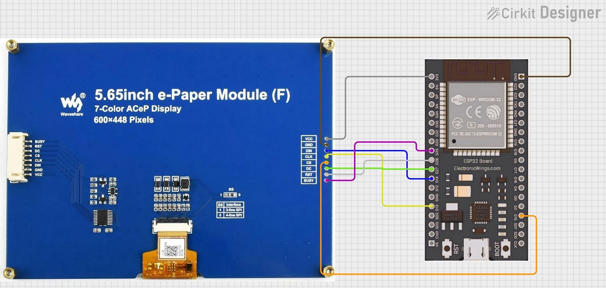

# ESP32 E-Paper Weather Display & Photo Frame

This project displays weather information and photos on e-Paper displays (like Waveshare 5.65"/7.3" 7-color and reTerminal 1002 Spectra E6) connected to an ESP32. It fetches weather data from various providers (OpenWeatherMap, Open-Meteo, Meteomatics, Google Weather, SMHI, AQICN), generates an image with the forecast, applies advanced dithering, and uploads it to the ESP32 for display. Configuration is now managed through a convenient Web UI.

## Features

* Displays current weather conditions (temperature, icon, description).
* Displays current Air Quality Index (AQI) if configured.
* Shows a detailed hourly forecast graph (temperature, wind, rain).
* Provides a multi-day forecast summary (icons, high/low temperatures, rain, wind, UV, daily AQI).
* Supports multiple weather data providers (OpenWeatherMap, Open-Meteo, Meteomatics, Google Weather, SMHI, AQICN) via configuration.
* **Mix and Match Data:** Optionally supplement data from the primary provider with specific parameters (like UV index, AQI) from other configured providers.
* Selectable icon sources (OpenWeatherMap, Google, Meteomatics) for different parts of the display (current/daily vs. graph).
* Caches weather data to reduce API calls.
* Provider-specific caching: Cache is invalidated if the weather provider is changed.
* Configurable cache lifetime.
* Customizable graph appearance through configuration file.
* Asynchronous data fetching for improved performance.
* Optimized for 7-color e-Paper displays.
* Configurable display details for current weather and daily forecast sections.
* **Web UI:** Easy configuration of providers, display settings, and graph appearance through a browser.
* **Photo Frame Mode:** Interleave weather forecasts with personal photos.
* **Multiple Display Drivers:** Support for standard Waveshare 7-color displays and reTerminal E6 with strict hardware color mapping.
* **Advanced Dithering:** Custom error diffusion and ordered dithering algorithms for optimal image quality on e-ink.
* **MQTT & Home Assistant:** Integration for status reporting and control (reTerminal firmware).

<div align="center">
  
</div>

<div align="center">
  
</div>

## Hardware Requirements

* ESP32 development board
* Supported E-Paper Displays:
    * Waveshare 5.65-inch or 7.3-inch 7-Color (F) display
    * reTerminal 1002 Spectra E6
* Jumper wires (if using bare Waveshare module)

**Pin Connections (ESP32 to Waveshare e-Paper):**

*   VCC  - 3V3
*   GND  - GND
*   DIN  - GPIO14
*   CLK  - GPIO13
*   CS   - GPIO15
*   DC   - GPIO27
*   RST  - GPIO26
*   BUSY - GPIO25

<div align="center">
  
</div>


## Software Requirements

* Python 3.7 or higher (due to newer library features like `datetime.fromisoformat`)
* Required Python packages (install with `pip install -r requirements.txt`):
    * requests
    * Pillow (PIL) 
    * matplotlib
    * pysmhi
    * IPy
    * aiohttp
    * PyYAML (for YAML configuration)

## Resources

* [Waveshare E-Ink display](https://www.waveshare.com/wiki/5.65inch_e-Paper_Module_(F)_Manual#Overview)
* [Waveshare FW for ESP32](https://files.waveshare.com/upload/5/50/E-Paper_ESP32_Driver_Board_Code.7z)

## Setup

1.  **Configure ESP32:**
      *   You'll need to install the ESP32 Arduino core and the relevant e-Paper driver libraries.
      *   Connect the wires as shown in the diagram above (for Waveshare displays).
      *   Choose the appropriate firmware from the `esp32fw/` directory:
          *   `esp32fw/waveshare_epd5in65f/`: For standard Waveshare HTTP upload.
          *   `esp32fw/reterminal_1002/`: For reTerminal E6 with MQTT support.
      *   For Waveshare, edit the `srvr.h` file to update your WiFi credentials:
          ```c
          const char *ssid = "your ssid";
          const char *password = "your password";
          ```
      *   You also need to update the pin configuration in `epd.h` to match your wiring:
          ```c
          #define PIN_SPI_SCK  13
          #define PIN_SPI_DIN  14
          #define PIN_SPI_CS   15
          #define PIN_SPI_BUSY 25 // Or your BUSY pin
          #define PIN_SPI_RST  26 // Or your RST pin
          #define PIN_SPI_DC   27 // Or your DC pin
          ```
      *   After these modifications, flash the firmware. This creates a web interface on the ESP32 that allows uploading images. Note the IP address assigned to your ESP32. The assigned IP address is printed in the Arduino IDE serial monitor. Navigate to the address and verify that the server is up and running.

2.  **Install Requirements:**
    *   Open a terminal or command prompt in the project directory.
    *   Run: `pip install -r requirements.txt`

3.  **Run the Application & Configure via Web UI:**
    *   Start the backend server using Uvicorn (FastAPI):
        ```bash
        uvicorn app.main:app --host 0.0.0.0 --port 8000
        ```
    *   Open your web browser and navigate to `http://localhost:8000`.
    *   **Configuration is now entirely managed through the Web UI.** You no longer need to manually edit a `config.yaml` file.
    *   Use the UI to:
        *   Set your location (Latitude/Longitude).
        *   Enter API keys for your chosen weather providers.
        *   Select primary and supplemental weather providers.
        *   Configure the ESP32 IP address or MQTT settings for image upload.
        *   Customize the 24-hour forecast graph appearance, series, and colors.
        *   Manage Photo Frame mode settings and upload photos.


## Weather Provider Parameter Support

This table summarizes the weather parameters supported by each provider. Note that availability may vary based on location and specific API plans. This reflects a hypothetical, comprehensive dataset; actual support should be verified by testing and consulting provider documentation.
| Parameter     | open-meteo | openweathermap | meteomatics | google | smhi | aqicn |
| --------------- | :--------: | :------------: | :----------: | :----: | :-----------: | :----: |
| `temp`          |     ✅      |       ✅        |      ✅       |   ✅   |      ✅       |   ❌   |
| `feels_like`    |     ✅      |       ✅        |      ✅       |   ✅   |      ❌       |   ❌   |
| `humidity`      |     ✅      |       ✅        |      ✅       |   ✅   |      ✅       |   ❌   |
| `uvi`           |     ✅      |       ✅        |      ✅       |   ✅   |      ❌       |   ❌   |
| `wind_speed`    |     ✅      |       ✅        |      ✅       |   ✅   |      ✅       |   ❌   |
| `wind_gust`     |     ✅      |       ✅        |      ✅       |   ✅   |      ✅       |   ❌   |
| `wind_deg`      |     ✅      |       ✅        |      ✅       |   ✅   |      ✅       |   ❌   |
| `rain`          |     ✅      |       ✅        |      ✅       |   ✅   |      ✅       |   ❌   |
| `snow`          |     ✅      |       ✅        |      ✅       |   ✅   |      ✅       |   ❌   |
| `weather`       |     ✅      |       ✅        |      ✅       |   ✅   |      ✅       |   ❌   |
| `hourly`        |     ✅      |       ✅        |      ✅       |   ✅   |      ✅       |   ❌   |
| `daily`         |     ✅      |       ✅        |      ✅       |   ✅   |      ✅       |   ❌   |
| `alerts`        |     ❌      |       ✅        |      ✅       |   ✅   |      ✅       |   ❌   |
| `precipitation` |     ✅      |       ✅        |      ✅       |   ✅   |      ✅       |   ❌   |
| `summary`       |     ✅      |       ✅        |      ✅       |   ✅   |      ✅       |   ❌   |
| `aqi` (current) |     ❌      |       ❌        |      ❌       |   ❌   |      ❌       |   ✅   |
| `aqi` (daily)   |     ❌      |       ❌        |      ❌       |   ❌   |      ❌       |   ✅   |


## Customization

*   **Web UI:** Almost all customization (Providers, Displayed Details, Graph Colors, etc.) is now done directly through the Web UI.
*   **Font:** Change the `font_path` variables in the backend code to use different TrueType fonts.
*   **Display:** Adjust the image processing and upload code in `backend/upload.py` or `backend/display_drivers.py` to support different e-Paper display models or upload methods.

## Troubleshooting

*   **Display Issues:** Double-check the wiring between the ESP32 and the e-Paper display. Ensure the correct firmware is flashed and running.
*   **Network Errors:** Verify your ESP32 is connected to your WiFi network. Confirm the ESP32 IP address in the Web UI matches the ESP32's actual IP address. Check firewall settings if applicable.
*   **API Errors:**
    *   Verify the API key/credentials in the Web UI for your selected weather providers are correct and active.
    *   Check the script output for specific error messages from the provider (e.g., 401 Unauthorized, 403 Forbidden, 429 Rate Limit).
    *   Consult the documentation for your chosen weather provider regarding API limits and potential costs (especially Google Weather).
    *   Check the status page of the weather provider if errors persist.
*   **Icon Issues:** Ensure the `icon_provider_display` and `icon_provider_graph` settings are correct. If icons are missing, check the script output for warnings about unmapped conditions or download errors. Clear the `icon_cache` directory if you suspect corrupted icons.
*   **`AttributeError: 'FreeTypeFont' object has no attribute 'getsize'`:** You are likely using Pillow 10.0.0 or newer. Ensure `create_weather_info.py` uses `font.getlength(text)` instead of `font.getsize(text)[0]` for calculating text width.

## Contributing

Contributions are welcome! Feel free to submit pull requests for bug fixes, new features, or improvements.

## License

This project is licensed under the MIT License - see the LICENSE file for details.
