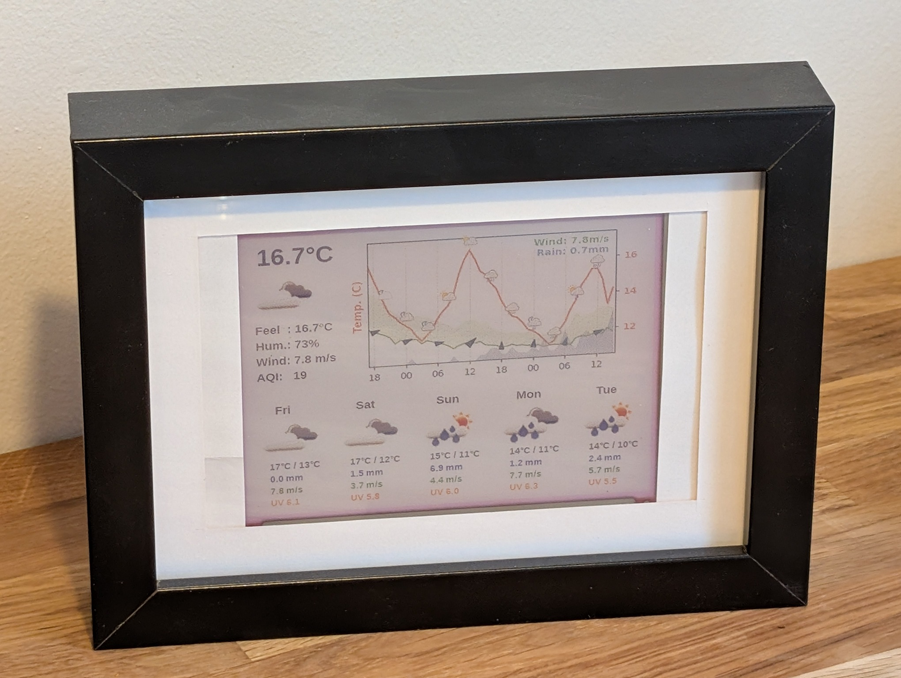

# ESP32 Weather Display with Waveshare 5.65-inch e-Paper

This project displays weather information on a Waveshare 5.65-inch e-Paper display connected to an ESP32. It fetches weather data from various providers (OpenWeatherMap, Open-Meteo, Meteomatics, Google Weather, SMHI, AQICN), generates an image with the forecast, and uploads it to the ESP32 for display.

## Features

* Displays current weather conditions (temperature, icon, description).
* Displays current Air Quality Index (AQI) if configured.
* Shows a detailed hourly forecast graph (temperature, wind, rain).
* Provides a multi-day forecast summary (icons, high/low temperatures, rain, wind, UV, daily AQI).
* Supports multiple weather data providers (OpenWeatherMap, Open-Meteo, Meteomatics, Google Weather, SMHI, AQICN) via configuration.
* **Mix and Match Data:** Optionally supplement data from the primary provider with specific parameters (like UV index, AQI) from other configured providers.
* Selectable icon sources (OpenWeatherMap, Google, Meteomatics) for different parts of the display (current/daily vs. graph).
* Caches weather data to reduce API calls.
* Provider-specific caching: Cache is invalidated if the weather provider is changed.
* Configurable cache lifetime.
* Customizable graph appearance through configuration file.
* Asynchronous data fetching for improved performance.
* Optimized for 7-color e-Paper displays.
* Configurable display details for current weather and daily forecast sections.

<div align="center">
  
</div>

<div align="center">
  
</div>

## Hardware Requirements

* ESP32 development board
* Waveshare 5.65-inch e-Paper (F) display
* Jumper wires

**Pin Connections (ESP32 to Waveshare 5.65-inch e-Paper):**

*   VCC  - 3V3
*   GND  - GND
*   DIN  - GPIO14
*   CLK  - GPIO13
*   CS   - GPIO15
*   DC   - GPIO27
*   RST  - GPIO26
*   BUSY - GPIO25

<div align="center">
  
</div>


## Software Requirements

* Python 3.7 or higher (due to newer library features like `datetime.fromisoformat`)
* Required Python packages (install with `pip install -r requirements.txt`):
    * requests
    * Pillow (PIL) 
    * matplotlib
    * pysmhi
    * IPy
    * aiohttp
    * PyYAML (for YAML configuration)

## Resources

* [Waveshare E-Ink display](https://www.waveshare.com/wiki/5.65inch_e-Paper_Module_(F)_Manual#Overview)
* [Waveshare FW for ESP32](https://files.waveshare.com/upload/5/50/E-Paper_ESP32_Driver_Board_Code.7z)

## Setup

1.  **Configure ESP32:**
      *   You'll need to install the ESP32 Arduino core and the e-Paper driver library. Detailed instructions can be found on the Waveshare e-Paper Wiki.
      *   Connect the wires as shown in the diagram above.
      *   Once the above linked firmware is downloaded and unpacked, the `.ino` file can be found in the `Loader_esp32wf` directory  
      *   You need to edit the `srvr.h` file to update your WiFi credentials:
          ```c
          const char *ssid = "your ssid";
          const char *password = "your password";
          ```
      *   You also need to update the pin configuration in `epd.h` to match your wiring:
          ```c
          #define PIN_SPI_SCK  13
          #define PIN_SPI_DIN  14
          #define PIN_SPI_CS   15
          #define PIN_SPI_BUSY 25 // Or your BUSY pin
          #define PIN_SPI_RST  26 // Or your RST pin
          #define PIN_SPI_DC   27 // Or your DC pin
          ```
      *   After these modifications, flash the firmware. This creates a web interface on the ESP32 that allows uploading images. Note the IP address assigned to your ESP32. The assigned IP address is printed in the Arduino IDE serial monitor. Navigate to the address and verify that the server is up and running.

2.  **Configure Python Script:**
    *   **Obtain Credentials:** Get the necessary API keys or credentials for the weather data provider(s) you intend to use:
        *   **OpenWeatherMap:** API Key for One Call API 3.0.
        *   **Open-Meteo:** No key required.
        *   **Meteomatics:** Username and Password.
        *   **SMHI:** No key required (uses `pysmhi` library).
        *   **Google Weather:** Google Cloud Platform API Key with Weather API enabled (Note: This is a paid service).
        *   **AQICN:** API Token for Air Quality Index data.
    *   **Create `config.yaml`:** Create a file named `config.yaml` in the same directory as the Python scripts. Use the example below and fill in your details:

        ```yaml
        latitude: YOUR_LATITUDE
        longitude: YOUR_LONGITUDE
        server_ip: "YOUR_ESP32_IP_ADDRESS" # Leave empty ("") if not uploading
        weather_provider: "smhi" # "openweathermap", "open-meteo", "meteomatics", "google", or "smhi"
        icon_provider_display: "openweathermap" # For current/daily icons. Options: "openweathermap", "google", "meteomatics"
        icon_provider_graph: "meteomatics"      # For graph icons. Options: "openweathermap", "google", "meteomatics"
        temperature_unit: "C" # "C" or "F"
        
        provider_list:
          - "open-meteo"
          - "openweathermap"
          - "meteomatics"
          - "google"
          - "smhi"
          - "aqicn"
        icon_provider_list:
          - "openweathermap"
          - "google"
          - "meteomatics"

        cache_duration_minutes: 10 # Optional, defaults to 60
        
        # Configuration for what details to show in the "Current Weather" panel
        current_weather_display_details:
          - "feels_like" # Options: "feels_like", "humidity", "wind_speed", "aqi"
          - "humidity"
          - "wind_speed"
          - "aqi"
        
        # Configuration for what details to show for each day in the "Daily Forecast"
        daily_forecast_display_details:
          - "temp"      # Shows Max/Min temperature. Options: "temp", "rain", "wind", "uvi", "aqi_pm25"
          - "rain"
          - "wind"      # Shows wind speed
          - "uvi"
          - "aqi_pm25"  # Shows PM2.5 average for the day

        # API Keys - only fill for providers you use
        google_api_key: "YOUR_GOOGLE_CLOUD_API_KEY"
        openweathermap_api_key: "YOUR_OPENWEATHERMAP_API_KEY"
        meteomatics_username: "YOUR_METEOMATICS_USERNAME"
        meteomatics_password: "YOUR_METEOMATICS_PASSWORD"
        aqicn_api_token: "YOUR_AQICN_TOKEN_HERE"
        ```
    *   **Configuration Details:**
        *   `latitude`, `longitude`: Your location.
        *   `server_ip`: The IP address of your ESP32 running the web server firmware. Leave empty (`""`) if not uploading.
        *   `weather_provider`: Choose the source for weather data: `"openweathermap"`, `"open-meteo"`, `"meteomatics"`, or `"google"`.
        *   `icon_provider_display`: Choose the icon source for current weather and daily forecast sections (e.g., "openweathermap", "google", "meteomatics").
        *   `icon_provider_graph`: Choose the icon source for the 24-hour graph (e.g., "openweathermap", "google", "meteomatics").
        *   `temperature_unit`: "C" for Celsius or "F" for Fahrenheit.
        *   Fill in the corresponding API key/credentials for your chosen `weather_provider`. Keys for unused providers can be left blank or as placeholders.
                *   `cache_duration_minutes`: (Integer, optional) How long the weather data cache is considered fresh, in minutes. Defaults to `60` if not specified.

    *   **Supplemental Providers (Optional):**
        You can configure the script to fetch specific data points from providers other than your primary `weather_provider` and merge them into the main dataset. This is useful if your primary provider lacks certain parameters (like UV index from SMHI's point forecast).

        Add a `supplemental_providers` key to your `config.yaml`. This should be a list of mappings, each specifying a `provider_name` and a list of `parameters` to merge.

        Example:
        ```yaml
        # ... your primary config here ...
        
        supplemental_providers:
          - provider_name: "open-meteo"
            parameters:
              - "uvi"
              - "rain"
          - provider_name: "AQICN"
            parameters:
              - "aqi" # For current AQI
              - "dominant_pollutant" # For current dominant pollutant
              - "aqi_pm25_avg" # For daily PM2.5 average forecast
        # Ensure you have credentials for these supplemental providers configured above
        # if they require authentication (e.g., google_api_key for "google").
        ```

        **Available Parameters for Merging:**
        Common parameters you can list in the `"parameters"` array include: `"temp"`, `"feels_like"`, `"humidity"`, `"uvi"`, `"wind_speed"`, `"wind_gust"`, `"weather"`, `"rain"`, `"snow"`, `"summary"`, `"aqi"`, `"dominant_pollutant"`, `"aqi_pm25_avg"`.
        Note that the supplemental provider must actually provide data for the parameters you list. Merging replaces the entire value for that parameter (including nested dictionaries/lists like `temp` for daily or `weather`).

3.  **Install Requirements:**
    *   Open a terminal or command prompt in the project directory.
    *   Run: `pip install -r requirements.txt`
4.  **Run the Script:**
    *   Execute `python create_weather_info.py`. This will fetch weather data (using cache if available), create the `weather_forecast_graph.png` image, and attempt to upload it to your ESP32 if `server_ip` is configured.
    *   By default, the script will look for `config.yaml` in the same directory as `create_weather_info.py`.
    *   You can specify a custom path to your configuration file using the `--config` argument:
        ```bash
        python /path/to/your/weather_display/create_weather_info.py --config /path/to/your/custom_config.yaml
        ```

5.  **Configuring the 24-Hour Forecast Graph (Optional):**
    The appearance and content of the 24-hour forecast graph can be extensively customized within your `config.yaml` file under the `graph_24h_forecast_config` key.

    Here's an example snippet showcasing some common configurations:

    ```yaml
    # In your config.yaml
    graph_24h_forecast_config:
      # --- General Graph Appearance ---
      base_font_size: 10
      show_y_grid_left: false
      show_y_grid_right: true
      graph_time_range_hours: 24

      # --- X-Axis Configuration ---
      x_axis_hour_interval: 6
      x_axis_time_format: "%H" # e.g., "18" for 6 PM

      # --- Legend Configuration ---
      legend:
        peak_value_display: # Displays max/min values directly on the graph
          enabled: true
          location: "in_graph"
          start_anchor_y: 0.97
          font_size: 9
          line_y_step: 0.075

      # --- Wind Arrow Configuration (on graph) ---
      wind_arrows:
        enabled: true
        color: "darkgreen"
        size: 12

      # --- Series Configuration (lines on the graph) ---
      series:
        - parameter: "temp"
          axis_label: "Temp (°C)"
          axis: "right"
          color: "#FF6347" # Tomato red
          scale_type: "auto_padded"
          data_occupancy_factor: 0.8
        - parameter: "wind_speed"
          legend_label: "Wind"
          axis: "left"
          color: "#32CD32" # Lime green
          show_peak_in_legend: true # If peak_value_display is enabled
          unit: "m/s"
          scale_type: "manual_range"
          y_axis_min: 0
          y_axis_max: 20
        - parameter: "rain"
          legend_label: "Rain"
          axis: "left"
          color: "#1E90FF" # Dodger blue
          plot_type: "fill_between" # Creates a filled area for rain
          alpha: 0.4
          scale_type: "manual_range"
          y_axis_min: 0
          y_axis_max: 10
    ```

    **Key `graph_24h_forecast_config` options:**
    *   `base_font_size`: Controls the general font size for graph elements.
    *   `graph_time_range_hours`: How many hours the graph should display.
    *   `x_axis_hour_interval`, `x_axis_time_format`: Customize X-axis time ticks and labels.
    *   `legend`: Configure either a standard legend or a `peak_value_display` that shows min/max values directly on the graph.
    *   `wind_arrows`: Enable and style wind direction arrows on the graph.
    *   `series`: A list defining each data series (line) to plot.
        *   `parameter`: The weather data parameter (e.g., "temp", "wind_speed", "rain").
        *   `axis_label`: Label for the Y-axis this series uses.
        *   `axis`: Assigns the series to the "left" or "right" Y-axis.
        *   `color`, `line_style`, `linewidth`: Visual styling.
        *   `scale_type`: How the Y-axis for this series is scaled (`auto_padded` or `manual_range`).
        *   `plot_type`: Can be set to `fill_between` for parameters like "rain" or "snow" to create an area fill.

    Refer to the `config.defaults.yaml` (if available) or the full example in `config.yaml` for all available options and detailed comments.


## Weather Provider Parameter Support

This table summarizes the weather parameters supported by each provider. Note that availability may vary based on location and specific API plans. This reflects a hypothetical, comprehensive dataset; actual support should be verified by testing and consulting provider documentation.
| Parameter     | open-meteo | openweathermap | meteomatics | google | smhi | aqicn |
| --------------- | :--------: | :------------: | :----------: | :----: | :-----------: | :----: |
| `temp`          |     ✅      |       ✅        |      ✅       |   ✅   |      ✅       |   ❌   |
| `feels_like`    |     ✅      |       ✅        |      ✅       |   ✅   |      ❌       |   ❌   |
| `humidity`      |     ✅      |       ✅        |      ✅       |   ✅   |      ✅       |   ❌   |
| `uvi`           |     ✅      |       ✅        |      ✅       |   ✅   |      ❌       |   ❌   |
| `wind_speed`    |     ✅      |       ✅        |      ✅       |   ✅   |      ✅       |   ❌   |
| `wind_gust`     |     ✅      |       ✅        |      ✅       |   ✅   |      ✅       |   ❌   |
| `wind_deg`      |     ✅      |       ✅        |      ✅       |   ✅   |      ✅       |   ❌   |
| `rain`          |     ✅      |       ✅        |      ✅       |   ✅   |      ✅       |   ❌   |
| `snow`          |     ✅      |       ✅        |      ✅       |   ✅   |      ✅       |   ❌   |
| `weather`       |     ✅      |       ✅        |      ✅       |   ✅   |      ✅       |   ❌   |
| `hourly`        |     ✅      |       ✅        |      ✅       |   ✅   |      ✅       |   ❌   |
| `daily`         |     ✅      |       ✅        |      ✅       |   ✅   |      ✅       |   ❌   |
| `alerts`        |     ❌      |       ✅        |      ✅       |   ✅   |      ✅       |   ❌   |
| `precipitation` |     ✅      |       ✅        |      ✅       |   ✅   |      ✅       |   ❌   |
| `summary`       |     ✅      |       ✅        |      ✅       |   ✅   |      ✅       |   ❌   |
| `aqi` (current) |     ❌      |       ❌        |      ❌       |   ❌   |      ❌       |   ✅   |
| `aqi` (daily)   |     ❌      |       ❌        |      ❌       |   ❌   |      ❌       |   ✅   |


## Customization

*   **Providers:** Select your preferred `weather_provider`, `icon_provider_display`, and `icon_provider_graph` in `config.yaml`.
*   **Font:** Change the `font_path` variables in `create_weather_info.py` to use different TrueType fonts.
*   **Colors:** Modify the color value tuples (RGB) in `create_weather_info.py` to customize the display's appearance.
*   **Display:** Adjust the image processing and upload code in `upload.py` to support different e-Paper display models or upload methods.
*   **Displayed Details:** Modify `current_weather_display_details` and `daily_forecast_display_details` in `config.yaml` to choose what information is shown.

## Troubleshooting

*   **Display Issues:** Double-check the wiring between the ESP32 and the e-Paper display. Ensure the correct Waveshare firmware is flashed and running.
*   **Network Errors:** Verify your ESP32 is connected to your WiFi network. Confirm the `server_ip` in `config.yaml` matches the ESP32's actual IP address. Check firewall settings if applicable.
*   **API Errors:**
    *   Verify the API key/credentials in `config.yaml` for your selected `weather_provider` are correct and active.
    *   Check the script output for specific error messages from the provider (e.g., 401 Unauthorized, 403 Forbidden, 429 Rate Limit).
    *   Consult the documentation for your chosen weather provider regarding API limits and potential costs (especially Google Weather).
    *   Check the status page of the weather provider if errors persist.
*   **Icon Issues:** Ensure the `icon_provider_display` and `icon_provider_graph` settings are correct. If icons are missing, check the script output for warnings about unmapped conditions or download errors. Clear the `icon_cache` directory if you suspect corrupted icons.
*   **`AttributeError: 'FreeTypeFont' object has no attribute 'getsize'`:** You are likely using Pillow 10.0.0 or newer. Ensure `create_weather_info.py` uses `font.getlength(text)` instead of `font.getsize(text)[0]` for calculating text width.

## Contributing

Contributions are welcome! Feel free to submit pull requests for bug fixes, new features, or improvements.

## License

This project is licensed under the MIT License - see the LICENSE file for details.
