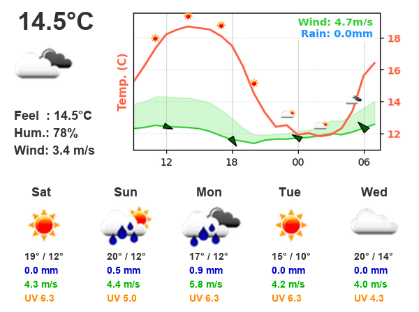

# ESP32 Weather Display with Waveshare 5.65-inch e-Paper

This project displays weather information on a Waveshare 5.65-inch e-Paper display connected to an ESP32. It fetches weather data from OpenWeatherMap, generates an image with a 12-hour forecast graph, and uploads it to the ESP32 for display.

## Features

* Displays current weather conditions (temperature, icon, description).
* Shows a detailed 12-hour forecast graph (temperature, wind, rain).
* Provides a 5-day forecast summary (icons, high/low temperatures, rain).
* Caches weather data to reduce API calls.
* Optimized for 7-color e-Paper displays.

## Hardware Requirements

* ESP32 development board
* Waveshare 5.65-inch e-Paper (F) display
* Jumper wires

## Software Requirements

* Python 3.6 or higher
* Required Python packages (install with `pip install -r requirements.txt`):
    * requests
    * Pillow (PIL)
    * matplotlib

## Resources

[Waveshare E-Ink display](https://www.waveshare.com/wiki/E-Paper_ESP32_Driver_Board)
[Waveshare FW for ESP32](https://files.waveshare.com/upload/5/50/E-Paper_ESP32_Driver_Board_Code.7z)

## Setup

1. **Configure ESP32:**
   * Follow the instructions in the Waveshare e-Paper Wiki to set up the display with your ESP32. You'll need to install the ESP32 Arduino core and the e-Paper driver library.
   * Flash the ino file in the "Loader_esp32wf" of the linked fw above. This creates a web interface on the ESP32 that allows uploading images.
2. **Configure Python Script:**
   * Obtain an API key from OpenWeatherMap.
   * Create a `config.json` file (see example above) and fill in your API key, latitude, longitude, ESP32 IP address, and upload URL.
3. **Run the Script:**
   * Execute `create_weather_info.py`. This will fetch weather data, create the image, and upload it to your ESP32.

## Customization

* **Font:** Change the `font_path` variable in `create_weather_info.py` to use a different font.
* **Colors:** Modify the color values in `create_weather_info.py` to customize the display's appearance.
* **Display:** Adjust the code in `upload.py` to support different e-Paper display models.

## Troubleshooting

* **Display Issues:** Double-check the wiring and ESP32 configuration.
* **Network Errors:** Ensure your ESP32 is connected to the network and the IP address in `config.json` is correct.
* **API Errors:** Verify your OpenWeatherMap API key and check for any error messages in the script output.

## Contributing

Contributions are welcome! Feel free to submit pull requests for bug fixes, new features, or improvements.

## License

This project is licensed under the MIT License - see the [LICENSE](LICENSE) file for details.